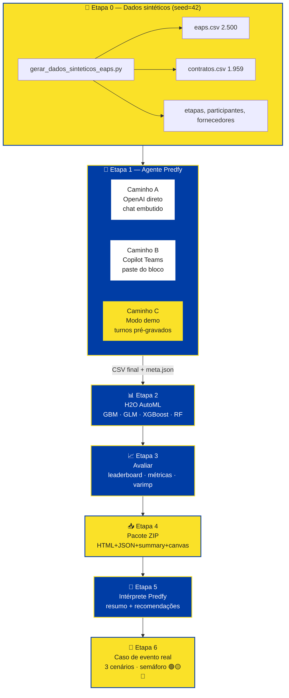
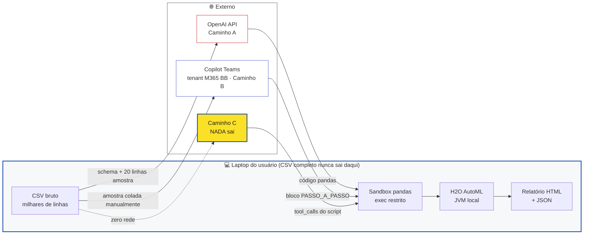
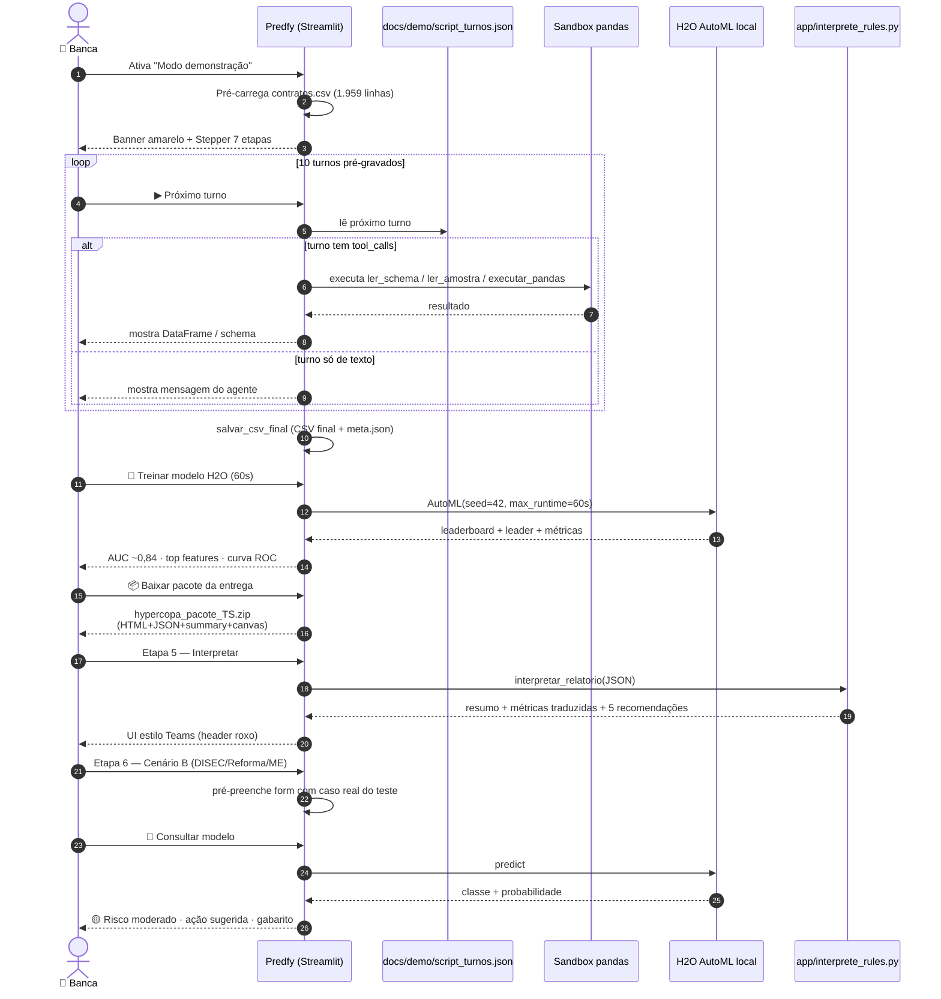
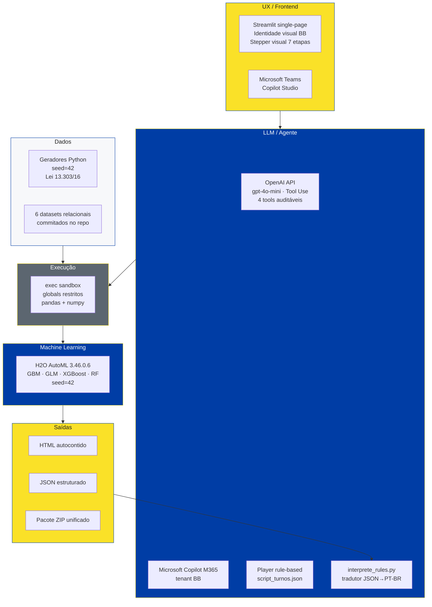
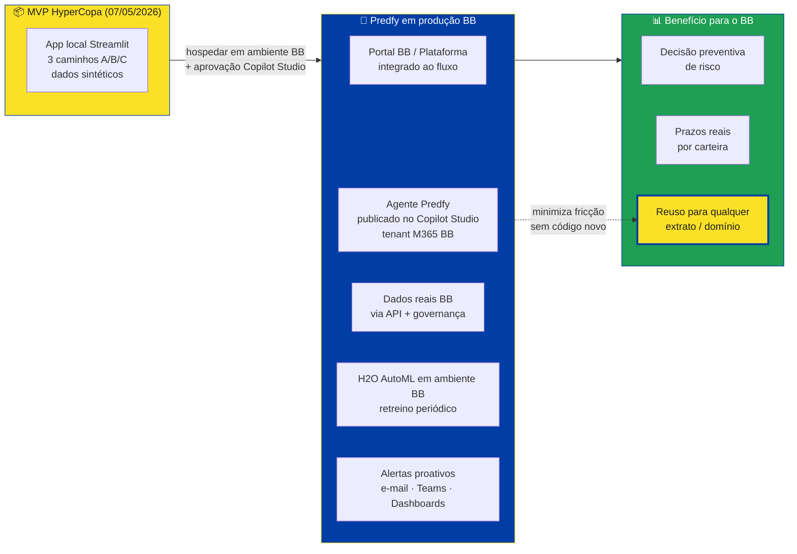

# Diagramas — Predfy

Diagramas Mermaid da arquitetura, jornada e fluxo de dados do Predfy.
Renderizados nativamente no GitHub e em qualquer Markdown viewer com Mermaid.

---

## 1. Visão geral — Jornada de 7 etapas e os 3 caminhos

> **Caminho C destacado** porque é o que a **banca avaliadora** usa: dispensa chave OpenAI e qualquer rede externa.

---

## 2. Privacidade — fluxo de dados sensíveis

**Garantias:**
- O **CSV completo nunca sai do laptop**, em nenhum dos 3 caminhos.
- No **Caminho A**, apenas schema + 20 linhas de amostra trafegam para OpenAI.
- No **Caminho B**, o usuário escolhe o que cola no Teams (texto pequeno, dentro do tenant BB).
- No **Caminho C** (banca), **zero rede externa**.

---

## 3. Sequência típica — sessão da banca em modo demo

---

## 4. Mapa de tecnologias por camada

---

## 5. Visão de produção — futuro Predfy no BB

> **Tese da equipe:** o **Agente Predfy** é o **componente que generaliza** o produto. Sem ele, cada nova pergunta de área demandante exigiria código. Com ele, qualquer extrato vira modelo treinado em minutos, no idioma de negócio.

---

*Diagramas mantidos pela Equipe HyperCopa DISEC 2026 — ECOA / CESUP-Contratações.*
