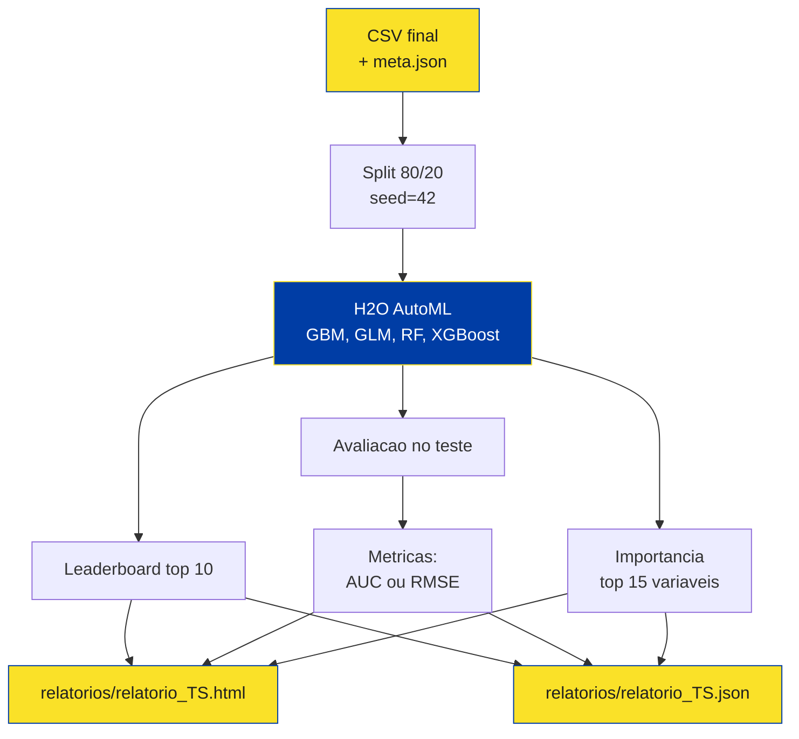
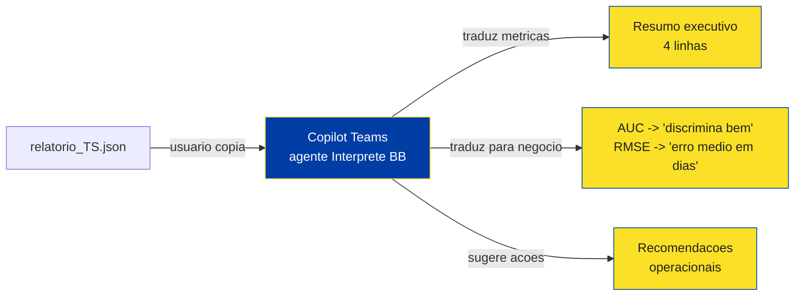
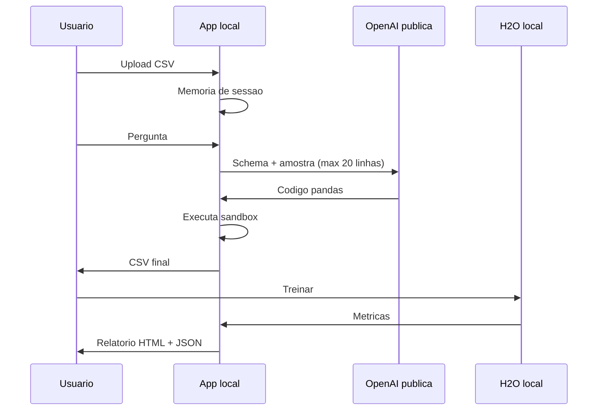
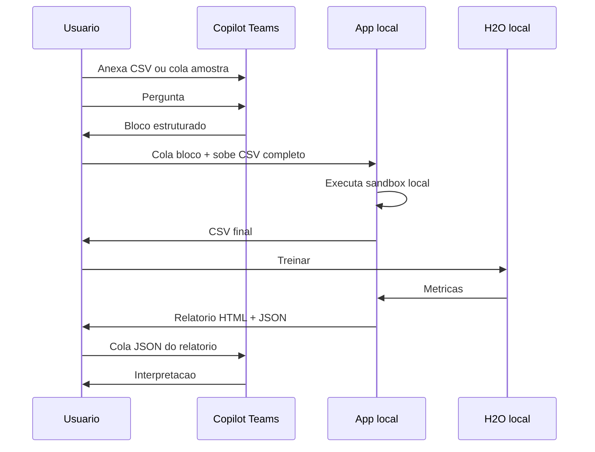

# Fluxograma da Jornada — Predfy — Preparador + Modelo Analítico

DISEC · Banco do Brasil · HyperCopa DISEC 2026
Time: Equipe HyperCopa DISEC 2026

A solução tem **três caminhos paralelos** para a Fase 1 (preparador): **A** (OpenAI direto), **B** (Microsoft Copilot do Teams) e **C** (Modo demonstração offline). A Fase 2 (treino H2O), a Fase 4 (Pacote ZIP) e a Fase 5 (interpretação) são iguais nos três.

> **Para a banca avaliadora**: o **Caminho C** dispensa chave OpenAI e qualquer rede externa. É o caminho recomendado para a avaliação. Ver `docs/COMO_AVALIAR.md`.

---

## Caminho A — OpenAI direto (chat embutido no app local)

```mermaid
flowchart LR
    A[Usuario] -->|sobe CSVs| B[App Streamlit local<br/>app_agente_bb.py]
    B -->|chat embutido| C[OpenAI API<br/>gpt-4o-mini]
    C -->|tool calls| D[Sandbox local<br/>pandas + numpy]
    D --> E[CSV final<br/>+ meta.json]
    E --> F[H2O AutoML<br/>30-300s]
    F --> G[Relatorio HTML BB<br/>+ relatorio.json]

    style A fill:#FAE128,stroke:#003DA5,stroke-width:2px,color:#1F1F1F
    style C fill:#003DA5,stroke:#FAE128,stroke-width:2px,color:#fff
    style F fill:#003DA5,stroke:#FAE128,stroke-width:2px,color:#fff
    style G fill:#FAE128,stroke:#003DA5,stroke-width:2px,color:#1F1F1F
```

**Quando usar Caminho A**: piloto fora da rede BB, demo externa, desenvolvimento local. Requer chave OpenAI.

---

## Caminho B — Microsoft Copilot do Teams (sem API, copy-paste)

```mermaid
flowchart LR
    A[Usuario] -->|abre agente<br/>Agente Predfy| B[Copilot Studio<br/>no tenant BB]
    B -->|chat conversacional<br/>cola CSV ou anexa| C[Copilot M365<br/>do Teams]
    C -->|devolve bloco estruturado| D[Usuario copia bloco]
    D --> E[App Streamlit local<br/>cola bloco no campo]
    E -->|sandbox executa| F[CSV final<br/>+ meta.json]
    F --> G[H2O AutoML<br/>30-300s]
    G --> H[Relatorio HTML BB<br/>+ relatorio.json]
    H -->|usuario copia JSON| I[Volta ao Copilot Teams]
    I -->|interprete em<br/>linguagem de negocio| J[Resumo + recomendacoes]

    style A fill:#FAE128,stroke:#003DA5,stroke-width:2px,color:#1F1F1F
    style C fill:#003DA5,stroke:#FAE128,stroke-width:2px,color:#fff
    style I fill:#003DA5,stroke:#FAE128,stroke-width:2px,color:#fff
    style G fill:#003DA5,stroke:#FAE128,stroke-width:2px,color:#fff
    style H fill:#FAE128,stroke:#003DA5,stroke-width:2px,color:#1F1F1F
    style J fill:#FAE128,stroke:#003DA5,stroke-width:2px,color:#1F1F1F
```

**Quando usar Caminho B**: produção BB. Trafega pelo tenant M365 BB, sob acordo Microsoft↔BB, sem dependência de OpenAI público. Sem custo adicional além da licença Copilot já paga.

> **Como criar o agente no Copilot Studio:** ver `docs/COPILOT_STUDIO_GUIA.md` (passo-a-passo, 20-30 min).

---

## Caminho C — Modo Demonstração offline (banca avaliadora)

```mermaid
flowchart LR
    A[Banca] -->|toggle 🎓 modo demo<br/>ON na sidebar| B[App Streamlit local<br/>app_agente_bb.py]
    B -->|pré-carrega CSV<br/>contratos_dicoi.csv| Z[CSV em memória<br/>1.959 linhas]
    A -->|▶ Próximo turno| P[Player de turnos<br/>determinístico]
    P -->|lê turno N| S[docs/demo/script_turnos.json<br/>10 turnos pré-gravados]
    S -->|tool_calls reais| D[Sandbox local<br/>pandas + numpy<br/>exec restrito]
    D -->|resultado por turno| B
    B -->|turno 10: salvar_csv_final| E[CSV final<br/>+ meta.json]
    E --> F[H2O AutoML<br/>seed=42 · 60s]
    F --> G[Relatório HTML BB<br/>+ relatorio.json]
    G --> R[Intérprete rule-based<br/>app/interprete_rules.py]

    style A fill:#FAE128,stroke:#003DA5,stroke-width:3px,color:#1F1F1F
    style P fill:#FAE128,stroke:#003DA5,stroke-width:2px,color:#1F1F1F
    style S fill:#FAE128,stroke:#003DA5,stroke-width:2px,color:#1F1F1F
    style F fill:#003DA5,stroke:#FAE128,stroke-width:2px,color:#fff
    style G fill:#FAE128,stroke:#003DA5,stroke-width:2px,color:#1F1F1F
    style R fill:#003DA5,stroke:#FAE128,stroke-width:2px,color:#fff
```

**Quando usar Caminho C**: avaliação da banca, ambientes restritos, demonstrações sem rede. **Zero chamadas externas** — todas as respostas do agente são pré-gravadas e versionadas em `docs/demo/script_turnos.json`. As 4 ferramentas (`ler_schema`, `ler_amostra`, `executar_pandas`, `salvar_csv_final`) executam **de verdade** no sandbox local, garantindo que a banca veja o mesmo comportamento dos Caminhos A/B com **resultado idêntico em qualquer máquina** (seed=42).

---

## Etapas comuns (depois da preparação, idêntico nos três caminhos)

### Etapa 2 — Modelo Analítico (H2O AutoML, local)

### Etapa 3 — Interpretação no Copilot Teams

> A Etapa 3 só é necessária no Caminho B. No Caminho A, o próprio app já mostra o relatório visual — o JSON é gerado mesmo assim para auditoria. No Caminho C, o intérprete `app/interprete_rules.py` lê o JSON localmente.

### Etapa 4 — Pacote ZIP unificado da entrega

Após a Etapa 3, o app oferece um botão único **"📦 Baixar pacote da entrega"** que monta em memória um único `.zip` com:

| Arquivo no ZIP | Função | Origem |
|---|---|---|
| `relatorio.html` | Relatório visual autocontido (paleta BB) | gerado pelo H2O |
| `relatorio.json` | Estrutura para auditoria + Copilot | gerado pelo H2O |
| `summary.md` | Resumo executivo de 1 página | gerado on-the-fly |
| `como_reproduzir.txt` | Comandos para regerar o resultado | template |
| `MVP_CANVAS.md` / `.docx` | Canvas do MVP completo | cópia de `docs/` |

> Esse ZIP é o **anexo único da entrega oficial à banca**. Substitui o vídeo regulamentar.

---

## Componentes técnicos por caminho

| Componente | Caminho A | Caminho B | Caminho C |
|---|---|---|---|
| Frontend conversacional | Streamlit (chat embutido) | Microsoft Teams | Streamlit + player de turnos |
| LLM | OpenAI `gpt-4o-mini`/`gpt-4o` | Copilot M365 (Microsoft) | Nenhum (turnos pré-gravados) |
| Onde a chave/licença mora | `.env` local do usuário | Tenant M365 BB | Nenhuma |
| Custo marginal por conversa | ~ R$ 0,30 (OpenAI) | R$ 0 (já incluso na licença Copilot) | **R$ 0** |
| Trânsito de dados | OpenAI público | M365 BB (governado) | **Zero rede externa** |
| Auditabilidade | Logs Streamlit | Microsoft Purview | Script versionado em git + logs Streamlit |
| Disponibilidade | Local apenas | Qualquer dispositivo Teams | Local apenas |
| Setup | `pip install` + chave | Copilot Studio (sem código) | `pip install` + toggle |
| **Quando usar** | Dev local | Produção BB | **Banca avaliadora** |

---

## Privacidade — fluxo de dados

### Caminho A

### Caminho B

**Observação chave:** no Caminho B, o **CSV completo nunca sai do laptop**. Apenas a amostra trafega pelo Teams (ambiente BB).
