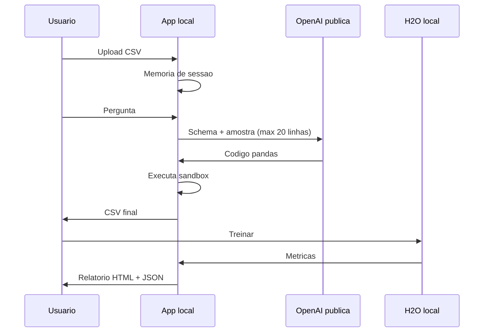
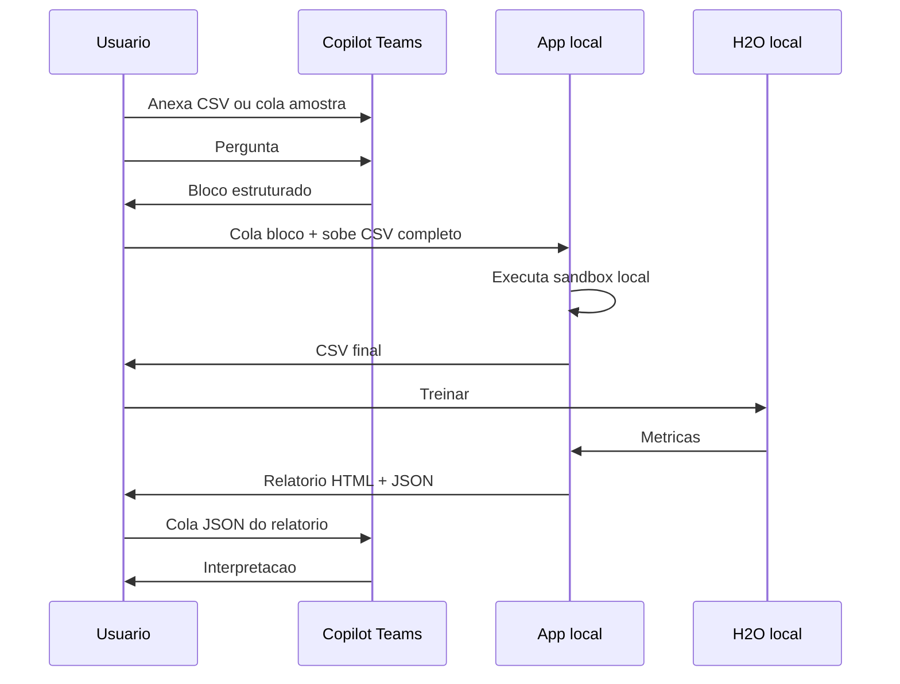

# Fluxograma da Jornada — Agente Preparador + Modelo Analítico

DISEC · Banco do Brasil · HyperCopa DISEC 2026
Time: Equipe HyperCopa DISEC 2026

A solução tem **dois caminhos paralelos** para a Fase 1 (preparador). A Fase 2 (treino H2O) e a Fase 3 (interpretação) são iguais nos dois.

---

## Caminho A — OpenAI direto (chat embutido no app local)

```mermaid
flowchart LR
    A[Usuario] -->|sobe CSVs| B[App Streamlit local<br/>app_agente_bb.py]
    B -->|chat embutido| C[OpenAI API<br/>gpt-4o-mini]
    C -->|tool calls| D[Sandbox local<br/>pandas + numpy]
    D --> E[CSV final<br/>+ meta.json]
    E --> F[H2O AutoML<br/>30-300s]
    F --> G[Relatorio HTML BB<br/>+ relatorio.json]

    style A fill:#FAE128,stroke:#003DA5,stroke-width:2px,color:#1F1F1F
    style C fill:#003DA5,stroke:#FAE128,stroke-width:2px,color:#fff
    style F fill:#003DA5,stroke:#FAE128,stroke-width:2px,color:#fff
    style G fill:#FAE128,stroke:#003DA5,stroke-width:2px,color:#1F1F1F
```



**Quando usar Caminho A**: piloto fora da rede BB, demo externa, desenvolvimento local. Requer chave OpenAI.

---

## Caminho B — Microsoft Copilot do Teams (sem API, copy-paste)


**Quando usar Caminho B**: produção BB. Trafega pelo tenant M365 BB, sob acordo Microsoft↔BB, sem dependência de OpenAI público. Sem custo adicional além da licença Copilot já paga.

> **Como criar o agente no Copilot Studio:** ver `docs/COPILOT_STUDIO_GUIA.md` (passo-a-passo, 20-30 min).

---

## Etapas comuns (depois da preparação, idêntico nos dois caminhos)

### Etapa 2 — Modelo Analítico (H2O AutoML, local)

```mermaid
flowchart TD
    CSV[CSV final<br/>+ meta.json] --> Split[Split 80/20<br/>seed=42]
    Split --> Train[H2O AutoML<br/>GBM, GLM, RF, XGBoost]
    Train --> LB[Leaderboard top 10]
    Train --> Test[Avaliacao no teste]
    Test --> Met[Metricas:<br/>AUC ou RMSE]
    Train --> Imp[Importancia<br/>top 15 variaveis]
    LB --> Out[relatorios/relatorio_{ts}.html]
    Met --> Out
    Imp --> Out
    LB --> JSON[relatorios/relatorio_{ts}.json]
    Met --> JSON
    Imp --> JSON

    style CSV fill:#FAE128,stroke:#003DA5,color:#1F1F1F
    style Train fill:#003DA5,stroke:#FAE128,color:#fff
    style Out fill:#FAE128,stroke:#003DA5,color:#1F1F1F
    style JSON fill:#FAE128,stroke:#003DA5,color:#1F1F1F
```

### Etapa 3 — Interpretação no Copilot Teams

```mermaid
flowchart LR
    JSON[relatorio_{ts}.json] -->|usuario copia| C[Copilot Teams<br/>agente Interprete BB]
    C -->|traduz metricas| R[Resumo executivo<br/>4 linhas]
    C -->|traduz para negocio| M[AUC -> 'discrimina bem'<br/>RMSE -> 'erro medio em dias']
    C -->|sugere acoes| A[Recomendacoes<br/>operacionais]

    style C fill:#003DA5,stroke:#FAE128,color:#fff
    style R fill:#FAE128,stroke:#003DA5,color:#1F1F1F
    style M fill:#FAE128,stroke:#003DA5,color:#1F1F1F
    style A fill:#FAE128,stroke:#003DA5,color:#1F1F1F
```

> A Etapa 3 só é necessária no Caminho B. No Caminho A, o próprio app já mostra o relatório visual — o JSON é gerado mesmo assim para auditoria.

---

## Componentes técnicos por caminho

| Componente | Caminho A | Caminho B |
|---|---|---|
| Frontend conversacional | Streamlit (chat embutido) | Microsoft Teams |
| LLM | OpenAI `gpt-4o-mini`/`gpt-4o` | Copilot M365 (Microsoft) |
| Onde a chave/licença mora | `.env` local do usuário | Tenant M365 BB |
| Custo marginal por conversa | ~ R$ 0,30 (OpenAI) | R$ 0 (já incluso na licença Copilot) |
| Trânsito de dados | OpenAI público | M365 BB (governado) |
| Auditabilidade | Logs Streamlit | Microsoft Purview |
| Disponibilidade | Local apenas | Qualquer dispositivo Teams |
| Setup | `pip install` + chave | Copilot Studio (sem código) |

---

## Privacidade — fluxo de dados

### Caminho A


### Caminho B


**Observação chave:** no Caminho B, o **CSV completo nunca sai do laptop**. Apenas a amostra trafega pelo Teams (ambiente BB).
